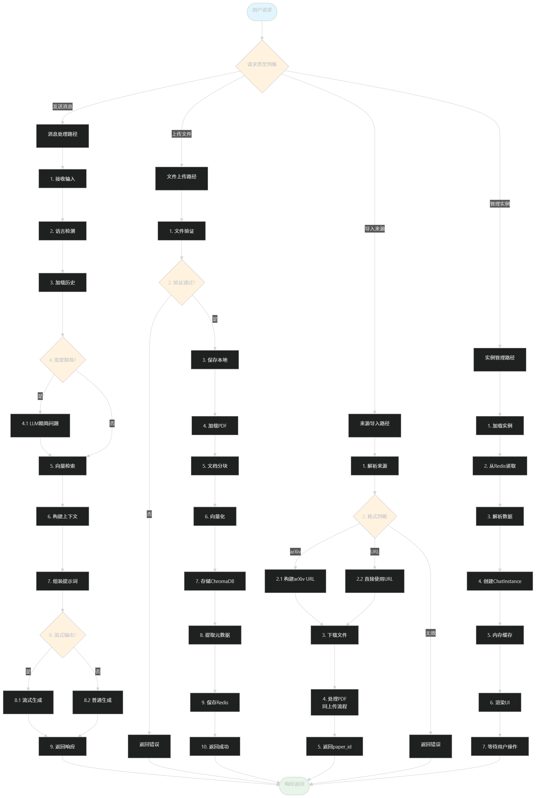
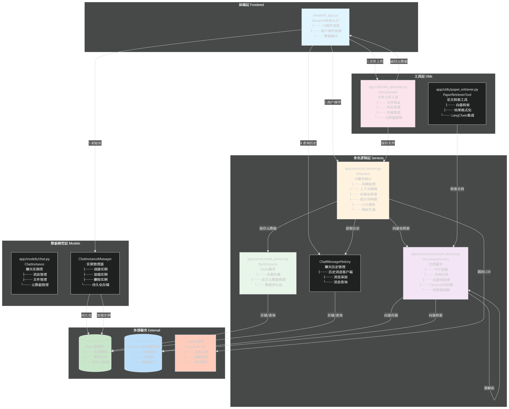

# 项目说明书

## 项目名称

AI智能论文助手

## 项目简介

AI智能论文助手是一个基于Streamlit构建的智能问答系统，专为学术论文处理和检索而设计。该系统支持用户上传PDF论文文件或输入论文URL/arXiv ID，通过大语言模型（LLM）进行智能问答，并能够根据论文内容提供精准的引用信息。系统采用向量数据库技术实现高效文档检索，支持多聊天实例管理，为学术研究人员提供便捷的论文分析和问答服务。

## 项目目标

1. 提供便捷的论文上传和管理功能
2. 实现基于大语言模型的智能问答
3. 支持论文内容的向量检索和引用
4. 提供多聊天实例管理，满足不同研究需求
5. 实现论文元数据自动提取和存储
6. 支持中英文混合问答

## 项目架构

### 系统架构

```
├── 前端界面 (streamlit_app.py)
│   ├── 聊天界面
│   ├── 文件上传
│   ├── 论文导入
│   └── 聊天实例管理
├── AI服务 (ai_service.py)
│   ├── 问题处理
│   ├── 大模型调用
│   └── 历史对话管理
├── 文档服务 (document_service.py)
│   ├── PDF解析
│   ├── 文档分块
│   ├── 向量嵌入
│   └── 向量存储
├── Redis服务 (redis_service.py)
│   ├── 聊天历史存储
│   └── 论文元数据管理
├── 配置文件 (settings.py)
│   ├── 服务器配置
│   ├── 模型配置
│   └── 数据库配置
└── 工具类
    ├── 文件上传工具
    └── 日志工具
```

### 系统流程图解



### 系统逻辑运行架构图解



### 技术栈

- **前端框架**: Streamlit
- **后端框架**: LangChain
- **大语言模型**: DeepSeek Chat (deepseek-chat, deepseek-reasoner)
- **嵌入模型**: DashScope Embedding (text-embedding-v4)
- **向量数据库**: ChromaDB
- **缓存数据库**: Redis
- **PDF解析**: PyPDF
- **其他依赖**: pypdf, dashscope, chromadb, redis, pydantic

## 项目结构

```
e:\代码\Paper_AI_Assistant\
├── app/                    # 应用核心代码
│   ├── models/             # 数据模型
│   ├── server/             # 服务器端逻辑
│   │   ├── ai_service.py   # AI服务
│   │   ├── chat_service.py # 聊天管理
│   │   ├── document_service.py # 文档服务
│   │   └── redis_service.py # Redis服务
│   └── utils/              # 工具类
│       └── file_uploader.py # 文件上传工具
├── config/                 # 配置文件
│   └── settings.py         # 全局配置
├── database/               # 数据存储
│   ├── .chroma_db/         # ChromaDB向量数据库
│   └── download/           # 上传文件存储
├── requirements.txt        # 项目依赖
├── run.py                 # 应用启动入口
└── streamlit_app.py        # Streamlit前端界面
```

## 项目功能

### 核心功能

1. **论文上传与管理**

   - 支持PDF文件上传
   - 支持URL和arXiv ID导入
   - 自动解析论文元数据（标题、摘要、页数等）
   - 论文向量化存储
2. **智能问答**

   - 基于大语言模型的智能问答
   - 支持上下文理解
   - 提供精准的论文引用
   - 支持中英文混合问答
3. **多聊天实例管理**

   - 支持多个独立聊天会话
   - 每个实例独立存储论文和对话历史
   - 实例间隔离，避免信息混淆
4. **向量检索**

   - 基于向量数据库的快速检索
   - 支持语义搜索
   - 精准定位论文内容
5. **引用管理**

   - 自动生成引用标记
   - 包含页码和段落号
   - 支持引用信息展示

### 界面功能

- 侧边栏聊天实例管理
- 文件上传区域
- 论文来源输入框
- 聊天消息显示区域
- 消息输入和发送功能
- 论文选择列表

## 项目配置文件

服务器配置说明：可以配置服务器地址及端口、文件上传大小及类型、向量数据库配置、Redis配置、LLM模型配置

环境变量配置说明：可以配置Chat对话模型与 Embedding向量化模型的API_KEY 与 URL地址

## 项目运维及部署

### 环境要求

- Python 3.8+
- Redis服务器
- 互联网连接（用于API调用）
- docker

### 安装步骤

1. 克隆项目仓库
2. 创建虚拟环境：`python -m venv venv`
3. 激活虚拟环境：`source venv/bin/activate` (Linux) 或 `venv\Scripts\activate` (Windows)
4. 安装依赖：`pip install -r requirements.txt`
5. 使用docker进行redis部署并启动：`docker-compose up -d`
6. 设置环境变量
7. 运行应用：`python run.py`

### 运行方式

1. 程序本地运行：`python run.py `
2. 容器化运行Redis：使用Docker容器化应用

## 性能优化

1. 优化向量检索算法
2. 缓存频繁查询的结果
3. 限制并发请求
4. 优化大模型调用频率
5. 压缩存储的文档数据
6. 历史聊天信息存储进行自动化总结

## 未来规划

1. 增加用户认证和权限管理
2. 支持团队协作和共享功能
3. 集成更多学术数据库
4. 提供论文分析报告
5. 增加语音交互功能
6. 优化AI模型性能
7. 扩展支持更多语言模型

## 联系方式

- 项目维护者：Erlong E Huo
- 联系邮箱：18535061027@163.com
- 项目仓库：https://github.com/ErlongEHuo/Paper_AI_Assistant
